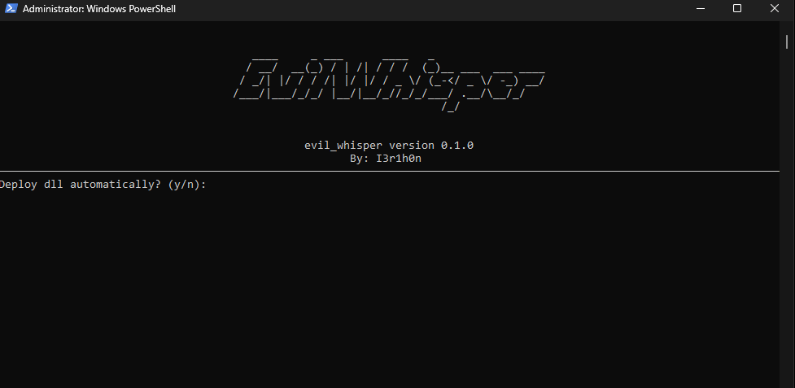
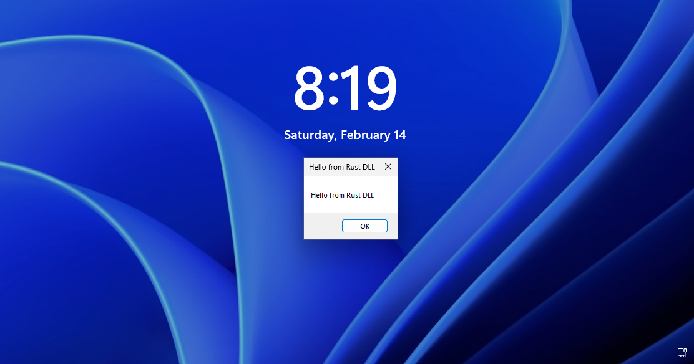

# EvilWhisper

## Description

A simple terminal tool written in rust, abusing the DLL Hijacking vulnerability in windows accessibility mechanism. Update the evil_dll code and rebuild the evil_whisper, and new dll will be compressed and place in evil_whisper.exe.

## Technique

The windows Narrator.exe loads the `msttsloc_onecoreenus.dll` which is not presented in a system by defauls. There is also a regestry key in HKLM or HKCU `Software\Microsoft\Windows NT\CurrentVersion\Accessibility`, allowing to autostart Narrator.exe at system startup.

Writing a malicious dll requires admin rights, or some arbitrary file write primitive. EvilWhisper allow you to exploit this DLL Hijacking ether using admin rights, or you can drop dll using your own method.

For more details read a [good article](https://trustedsec.com/blog/hack-cessibility-when-dll-hijacks-meet-windows-helpers) at TrustedSec website, or check the [old post](https://www.hexacorn.com/blog/2013/12/08/beyond-good-ol-run-key-part-5/) by hexacorn.

## Demo

## Creds

prod by _I3r1h0n_.
